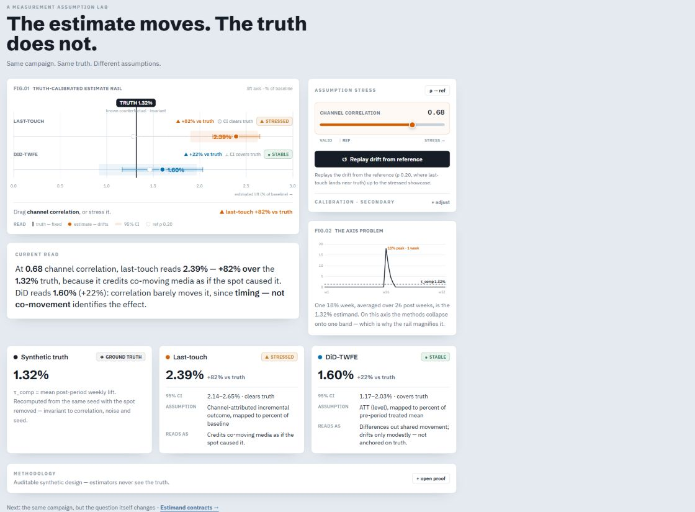

# Luneburn

**A Measurement Assumption Lab.** Same campaign. Same truth. Different assumptions.

Luneburn is a static, interactive portfolio artifact by [Yi Gong](https://github.com/yigong-yg). It uses synthetic campaigns with known counterfactual outcomes to show where measurement methods diverge, and when their numbers answer different questions.



## A 90-second tour

1. **0–20 seconds: inspect the assumption lab.** At seed 42, the true average post-period weekly lift is 1.32%. Last-touch reports 2.39%; DiD-TWFE reports 1.60%. The intervals, warning labels, and seed stability band make the disagreement inspectable.
2. **20–40 seconds: move channel correlation.** Use `ρ → ref`, then `Replay drift from reference`. Last-touch drifts while the truth stays fixed. Open Calibration to vary the effect and noise, or Methodology to inspect what the design assumes.
3. **40–65 seconds: follow Estimand contracts.** Compare Search's share of observed path credit with its paired channel-off oracle and share of joint lift. Each panel names its own question and denominator. MMM warnings distinguish omitted demand and interaction from the target mismatch; estimates can still be noisy even when diagnostics pass.
4. **65–90 seconds: choose the question before the number.** Switch among path credit, channel-off effects, and joint-lift allocation. Move Demand capture or Search × Video synergy, answer the decision check, and use Copy this state to reproduce the estimand lab's exact settings.

The numbers above describe the canonical defaults; the app computes them from seeded data. A channel-off effect and a Shapley allocation are different quantities. Observational path credit is never labeled causal lift.

## Run locally

Use Node.js 22 and npm. From the repository root:

```sh
npm ci
npm run dev
```

Open the local address printed by Vite. The routes are `#/assumptions` and `#/estimands`. Page two encodes its controls, question, and seed in the URL; page one's controls currently remain local state.

## Verify

```sh
npm run lint
npm test
npm run build
```

The GitHub Actions workflow runs the same checks on pushes to `main` and on pull requests and caps built JavaScript at 80 kB gzip. Separately, pre-release browser acceptance must exercise both routes at desktop and 390px, including every control, warning labels, copy round trips, and keyboard navigation; that sweep is not part of CI.

Tests cover deterministic generation, paired-oracle invariants, estimator validity/stress/unsupported fixtures, question and unit compatibility, URL state, and rendering-critical interactions. Estimators cannot use the oracle to produce estimates; known truth is for display and diagnostics.

MMM causal recovery is tested against the real paired DGP, separately from a linear-algebra sanity fixture. The high-information regime uses 156 weeks, 6,000 opportunities/week, noise 0.2, exogenous spend, and zero synergy. Each channel must recover its oracle within 10% at seeds 2307, 42, and 2718. An additional diagnostic sweep over seeds 1–20 found 59 of 60 channel estimates within 10%; the largest error was 11.5%. This is finite-sample evidence, not a universal recovery guarantee. The interactive 104-week, 120-opportunity default has more sampling uncertainty.

Independent randomized weekly media plans supply variation beyond seasonality. Separate random streams preserve outcome draws when touch generation changes. Campaign noise scales both weekly demand shocks and individual outcome noise. The stress fixture compares signed Search error at low and high demand capture using the same seed; arbitrary seeds need not have monotonically increasing absolute error. Media diagnostics use each channel's residual variation after conditioning on all other media and trend/seasonal controls (warning below 20%, equivalent to VIF above 5). The upper ridge-grid edge also warns. These diagnostics cannot establish exchangeability; simulation-only omitted-demand and omitted-interaction warnings remain separate from estimation.

Markov removal sends removed transition mass to NULL instead of renormalizing remaining destinations. It therefore does not assume substitution into other recorded channels.

## Design and limits

React, strict TypeScript, Vite, Tailwind, Zustand, and bespoke SVG charts. All computation runs in the browser. There are no accounts, uploads, backend, or real-data measurement features. Analytics currently dispatch local events without a network provider.

- **Assumption stress:** one synthetic Super Bowl scenario, last-touch attribution, and DiD-TWFE.
- **Estimand contracts:** one multichannel scenario, Markov path credit, MMM-lite, and paired channel-off and Shapley oracles. MMM is deliberately small enough to audit; it is not a production planning model.
- **Uncertainty:** displayed intervals depend on the method's assumptions. Coverage of one known truth does not certify identification. The seed band is a deterministic sweep, not a confidence interval.

## Deployment

The production build is the static `dist/` directory. For a Vercel project, use the repository root, the Vite preset, `npm run build`, and output directory `dist`. Hash routes do not require server rewrites. No application secrets are required.

Public launch is pending. A production URL will be added after both routes have been verified on the deployed build.

[MIT license](LICENSE).
